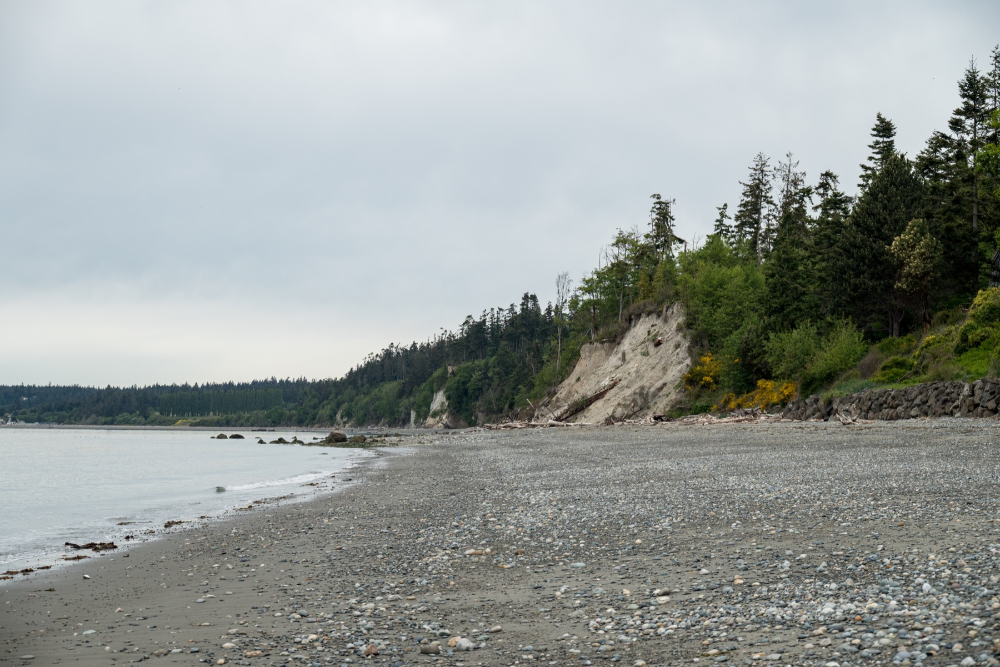

A curated collection of fieldwork, laboratory work, landscapes, teaching, and life outside science will live here.

::: {.gallery-grid}
::: {.gallery-placeholder}
{.gallery-image fig-alt="Salar Grande Fault landscape"}

### Fieldwork
Atacama Desert, active faults, geomorphic markers, sediment deposits, and field mapping.
:::

::: {.gallery-placeholder}
{.gallery-image fig-alt="Collecting an OSL sample in the Salar Grande region"}

### Lab work
Luminescence sampling, thermochronology, sample preparation, and analytical work.
:::

::: {.gallery-placeholder}
{.gallery-image fig-alt="Coastal bluffs and landslide deposits"}

### Landscapes
Deserts, mountains, rivers, glaciers, fjords, and landscapes that record tectonics and climate.
:::

::: {.gallery-placeholder}
{.gallery-image fig-alt="Teaching geoscience in a classroom"}

### Teaching and outreach
Workshops, mentoring, classrooms, public engagement, and bilingual science communication.
:::

::: {.gallery-placeholder}
{.gallery-image fig-alt="Code to Communicate online workshop"}

### Code to Communicate
Technical training, community, and bilingual science communication.
:::

::: {.gallery-placeholder}
{.gallery-image fig-alt="Field mentoring along coastal bluffs"}

### Mentoring
Field learning, student research, and building confidence through observation.
:::
:::

::: {.note-box}
Add later: more images and final captions. Keep this curated rather than turning it into a full image dump.
:::
