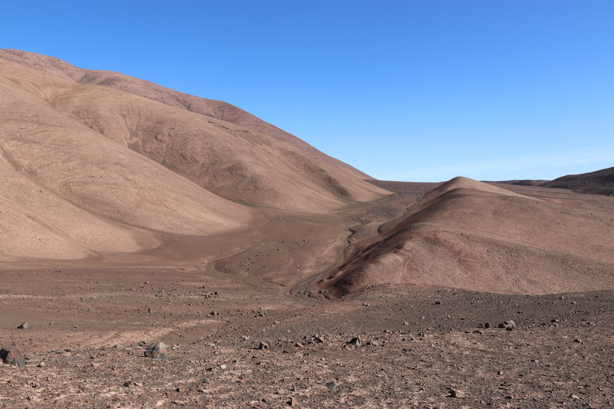
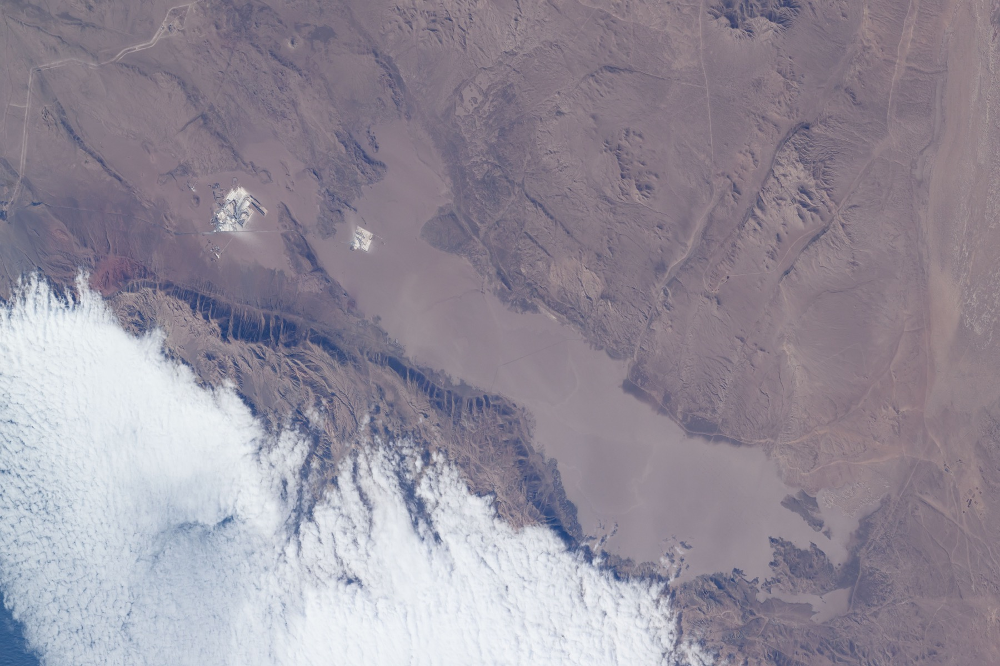
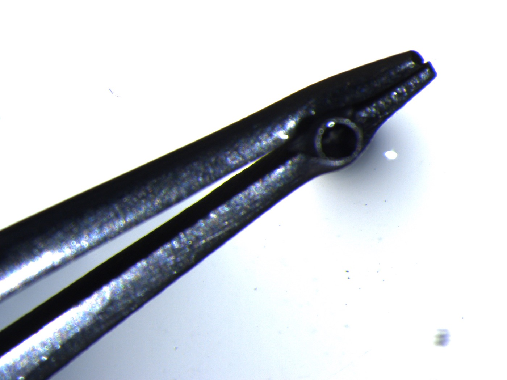
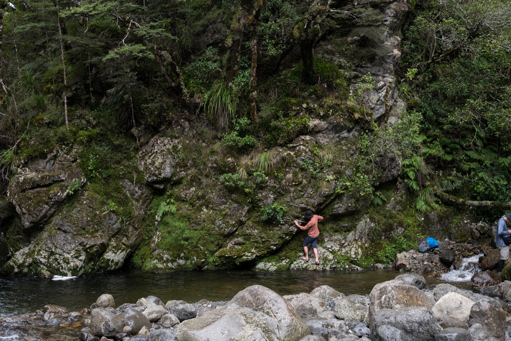
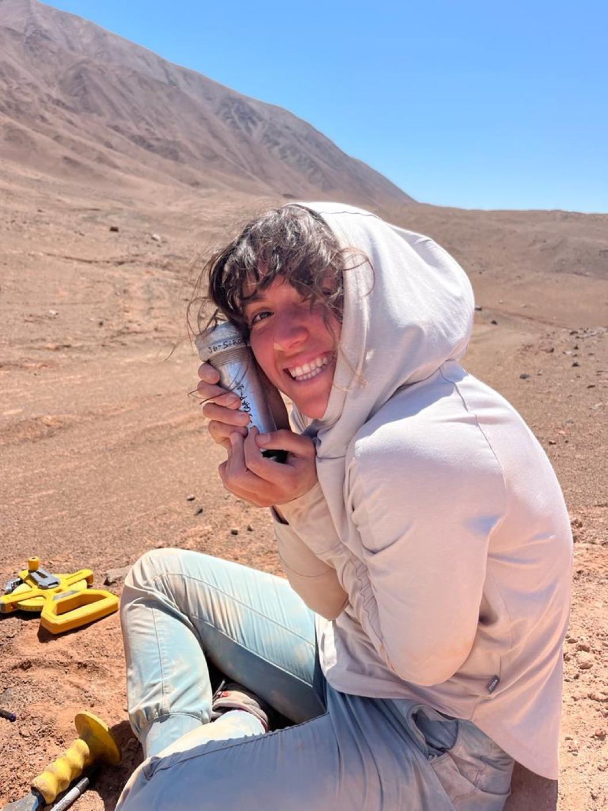

My research asks how landscapes record interacting tectonic and climatic processes. I use field observations, remote sensing, low-temperature thermochronology, geochronology, and landscape-evolution modeling to connect surface processes with fault slip, sediment transport, erosion, and mountain building.

::: {.research-feature}
### Big question

How do landscapes preserve tectonic signals when climate, sediment supply, and erosion are also changing?
:::

::: {.grid}

::: {.g-col-12 .g-col-lg-6}
::: {.research-card}
{.card-image fig-alt="Hyperarid landscape along the Salar Grande Fault"}

### Faults, earthquakes, and landscape response

I study how slowly slipping faults can leave measurable records in topography, drainage networks, sediment deposits, and surface deformation.

**Working themes:** Salar Grande Fault, Atacama Fault System, InSAR, GNSS, geomorphic markers, fault slip, drainage response, paleoseismic deposits, and hyperarid landscapes.
:::
:::

::: {.g-col-12 .g-col-lg-6}
::: {.research-card}
{.card-image fig-alt="Satellite image of the Salar Grande region"}

### Climate variability and sediment transport

I use landscape-evolution models to examine how climate oscillations and sediment cover influence rivers, drainage divides, aggradation, and fault-zone morphology.

**Working themes:** Landlab, arid and humid intervals, river capture, divide migration, sediment cover, channel morphology, and delayed geomorphic response.
:::
:::

::: {.g-col-12 .g-col-lg-6}
::: {.research-card}
{.card-image fig-alt="Mineral grains in a sample tube"}

### Thermochronology and exhumation

I use low-temperature thermochronology and geologic constraints to reconstruct cooling, exhumation, and basin development over millions of years.

**Working themes:** apatite helium, zircon helium, apatite fission track, HeFTy modeling, cooling histories, exhumation, pull-apart basin development, and the Coastal Cordillera.
:::
:::

::: {.g-col-12 .g-col-lg-6}
::: {.research-card}
{.card-image fig-alt="Mountain landscape in New Zealand"}

### Glacial and postglacial landscapes

My developing research expands these questions into mountain systems shaped by tectonics, ice, rivers, sediment routing, and changing climate.

**Working themes:** glaciated mountain systems, fjords, postglacial landscape response, sediment flux, glacial erosion, and tectonic geomorphology in mountain landscapes.
:::
:::

:::

## Project pages to add

::: {.task-list}
- Salar Grande Fault and landscape response
- Climate oscillations, sediment aggradation, and fault slip
- Thermochronology of the Coastal Cordillera
- Glacial and postglacial sediment routing
:::

## Field and analytical work

::: {.feature-row}
::: {.feature-image}
{fig-alt="OSL sample collection in the Salar Grande region"}
:::

::: {.feature-copy}
### Sampling landscape memory

Sediment samples, geomorphic markers, and remote observations help connect the field record to the timing and mechanics of landscape change.
:::
:::
