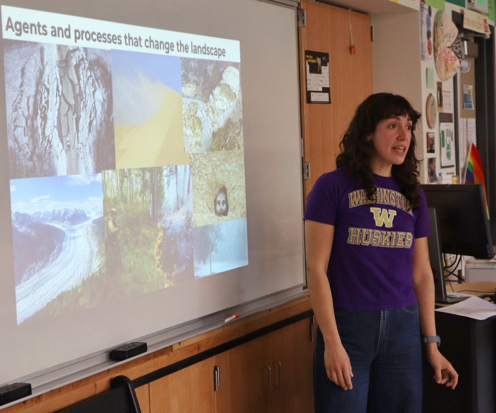
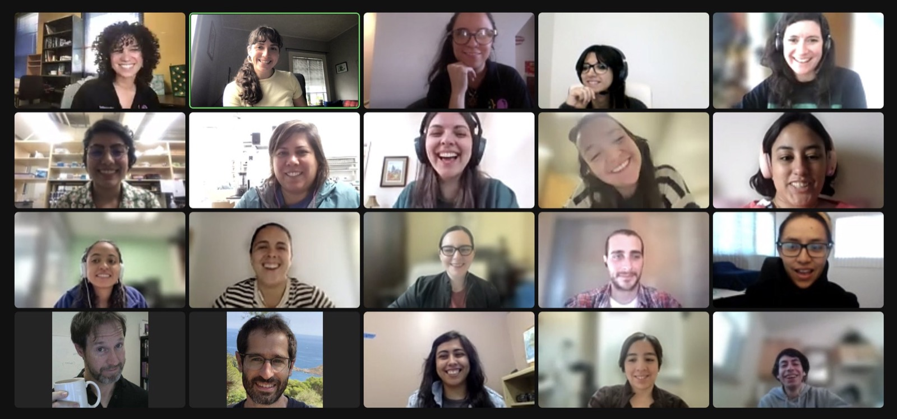
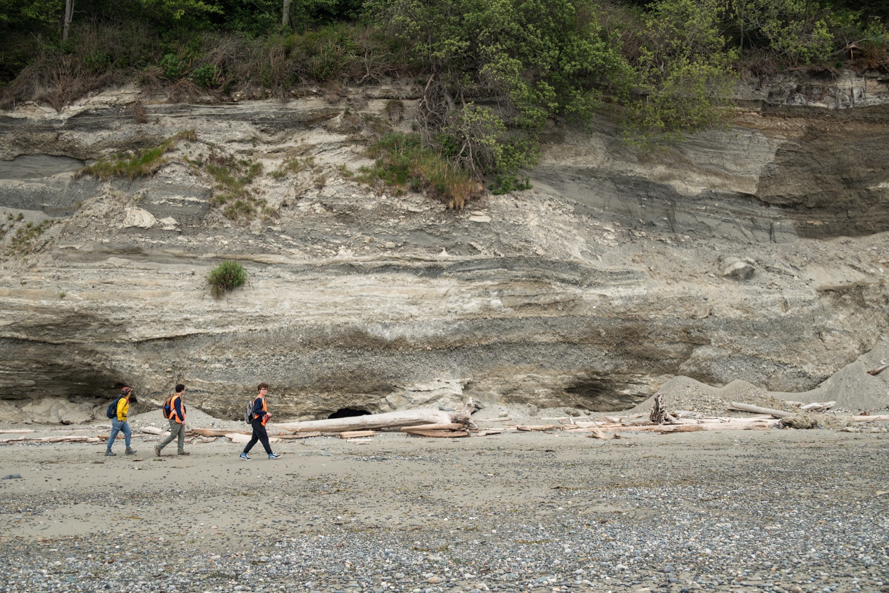

I care about creating welcoming spaces where people can explore geoscience, develop technical skills, and communicate ideas with confidence.

## Teaching and mentoring

My teaching emphasizes curiosity, clear communication, practical problem-solving, and an inclusive learning environment.

::: {.grid}

::: {.g-col-12 .g-col-md-6}
::: {.info-card}
{.card-image fig-alt="Tamara teaching a landscape processes lesson in a classroom"}

### University teaching

Courses and teaching assistant roles in geology, probability and statistics, physical chemistry, geologic hazards, and field-based learning.
:::
:::

::: {.g-col-12 .g-col-md-6}
::: {.info-card}
{.card-image fig-alt="Online Code to Communicate workshop participants"}

### Technical training

Python training, coding workshops, data visualization, and practical programming for geoscience.
:::
:::

:::

## Outreach and science communication

I enjoy making geoscience accessible through public engagement, bilingual communication, and creative approaches—including lessons learned through improvisational theater.

::: {.note-box}
Add later: CoCo activities, GeoLatinas involvement, public talks, outreach materials, and mentoring programs.
:::

## Mentoring and field learning

::: {.feature-row}
::: {.feature-image}
{fig-alt="Students and mentors walking along coastal bluffs during field learning"}
:::

::: {.feature-copy}
Mentoring is part of how I think about science: helping students build confidence with field observations, quantitative tools, and the process of asking research questions.
:::
:::
